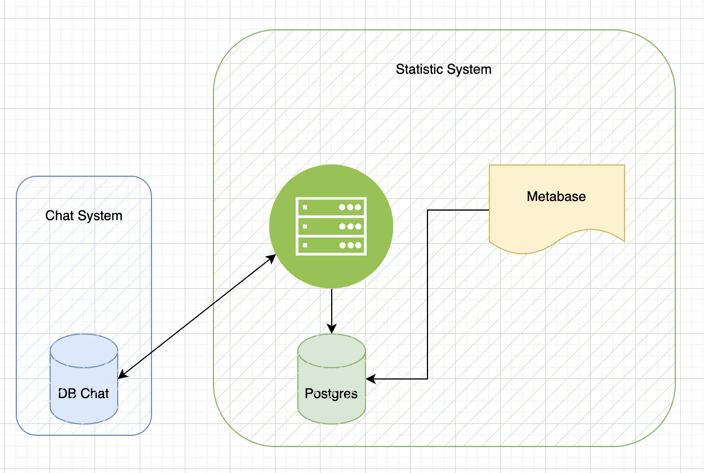

### System architecture



- Chat system: https://chat.hoctiep.com
- LMS system: https://lms.hoctiep.com

# LMS Learn With AI

A modern Learning Management System (LMS) with AI capabilities for enhanced educational experiences.

## Project Overview

This project is a full-stack application designed to provide learning management functionality with integrated AI assistance. It consists of:

- **Backend API**: FastAPI-based REST API with database integration
- **React Frontend**: Modern React application for user interface
- **Metabase Integration**: Analytics dashboard integration
- **Cron Jobs**: Scheduled tasks for data synchronization and maintenance

## Architecture

```
lms-learn-with-ai/
├── backend/                # Python FastAPI backend
│   ├── app/                # Application code
│   │   ├── db/             # Database models and connections
│   │   ├── scripts/        # Utility scripts
│   │   └── utils/          # Helper functions
│   ├── Dockerfile          # Docker configuration for backend
│   └── Dockerfile.cron     # Docker configuration for scheduled tasks
├── react-frontend/         # React frontend application
│   ├── public/             # Static assets
│   ├── src/                # Source code
│   │   ├── components/     # React components
│   │   └── metabase_iframe/  # Metabase dashboard integration
│   └── Dockerfile          # Docker configuration for frontend
└── docker-compose.app.yml  # Docker compose configuration
```

## Features

- **User Authentication**: Secure login and registration system
- **Course Management**: Create, view and manage learning content
- **Analytics Dashboard**: Integrated Metabase for detailed analytics
- **AI-powered Learning**: AI-assisted content delivery and student support
- **Data Synchronization**: Automated data transfer between databases

## Getting Started

### Prerequisites

- Docker and Docker Compose
- Node.js (for local development)
- Python 3.12 (for local development)

### Environment Setup

1. Clone the repository:
   ```bash
   git clone git@github.com:tran-the-lam/lms-learn-with-ai.git
   cd lms-learn-with-ai
   ```

2. Create necessary environment variables:
   - Backend environment variables (PostgreSQL connection, API tokens, etc.)
   - Frontend environment variables (API URL, Metabase configuration)

### Running with Docker

```bash
docker compose -f docker-compose.app.yml up --build
```

This will start:
- Backend API on port 8001
- React frontend on port 5001
- Cron service for scheduled tasks

### Local Development

#### Backend

```bash
cd backend
pip install -r requirements.txt
python -m app.main
```

#### Frontend

```bash
cd react-frontend
npm install
npm start
```

## API Documentation

API documentation is available at docs or `/redoc` when the backend is running.

## Deployment

The application is designed to be deployed using Docker Compose. Production deployment may require additional configuration for HTTPS, load balancing, and production database setup.

## Database Configuration

The system supports both SQLite (development) and PostgreSQL (production):

- **SQLite**: Used for local development and testing
- **PostgreSQL**: Recommended for production use

## Credits

Developed by the LMS Learn With AI team.

test runne
